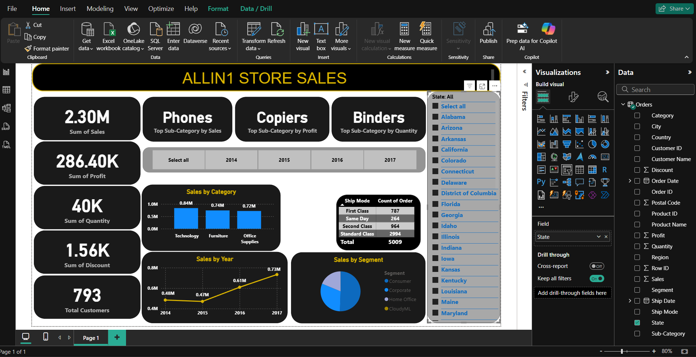

# 📊 PowerBI-Dashboard
This is an interactive Power BI dashboard designed to visualize and analyze the overall sales performance of a retail store. The dashboard helps stakeholders and decision-makers gain insights into sales, profitability, quantity, customer base, and distribution channels across different time periods and locations.

---

📌 **Key Metrics Displayed**

---

Total Sales: 2.30M
Total Profit: 286.40K
Total Quantity Sold: 40K
Total Discount: 1.56K
Total Customers: 793

⚡ All metrics update dynamically based on slicer selections (year or state).

---

🎯 **Dashboard Highlights**

---

- Top Sub-Categories
  - 🛒 Sales: Phones
  - 💰 Profit: Copiers
  - 📦 Quantity: Binders

- Interactive Filters
  - Year Selector: 2014 – 2017
  - State Filter: Drill-down by any U.S. state

- Visualizations
  - 📊 Sales by Category (Bar Chart)
  - 📈 Sales by Year (Line Chart)
  - 🧾 Orders by Ship Mode (Table)
  - 🧩 Sales by Segment (Pie Chart)

All charts are linked to the slicers and update based on user selections.

---

🧠 **Purpose**

---

- This project was created as part of my Business Analyst portfolio to demonstrate:
- Data visualization expertise
- Interactive storytelling through dashboards
- Ability to generate insights from raw sales data

---

🛠️ **Tools & Technologies Used**
- Power BI Desktop
- DAX for Measures and Calculations
- Superstore Dataset

---
